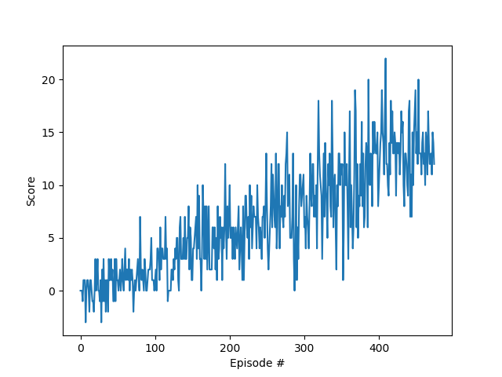

### Learning Algorithm

The hyper params of the agent training was: 
* max num of episodes: 2000
* max num iterations for episodes:1000
* initial value for episo to be used in the e-greedy police: 1.0
* minimal value of epison:0.01
* rate in which epsilon decay after each epoch: 0.995

The RL algorithm used in this implementation was the Q-learning and the agent was trained with the help of a full connected Neural Network NN with
three full connected layers. The function activation of each layer was the ReLU.

The NN used to train this agent, used the MSE algorith to oprimize the loos 
function

### Plot rewards

The rewads taken at each episode can see at the image bellow

In this plot you see the avaerage score os tha last 100 episodes. 
As you can notice, the is was capable to take more than +13.0 over the last
100 episodes.

### Ideas for Future Work

Here are some ideas to improve the training of the agent:

* The NN used here can be improved by including a drop out layer in its archecture
* A L2 regularization also can be used to prevent overfiting.
* It would be nice modify the NN architecture to use a 1d convolution layer so it could
stract some pattern of the satete before it be infered by the full connected layer.
* 